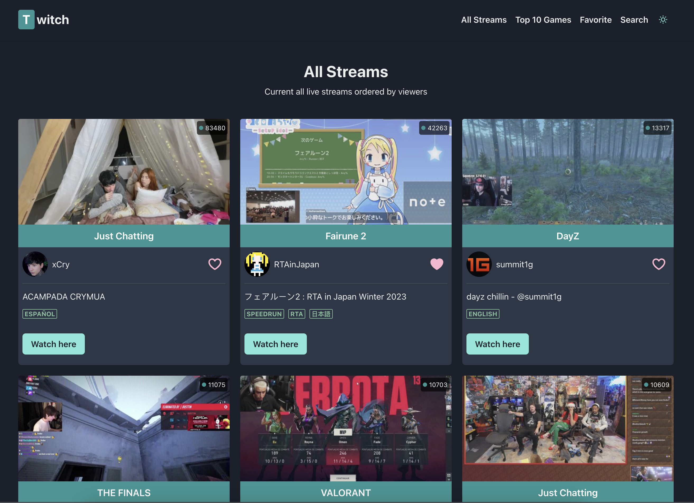
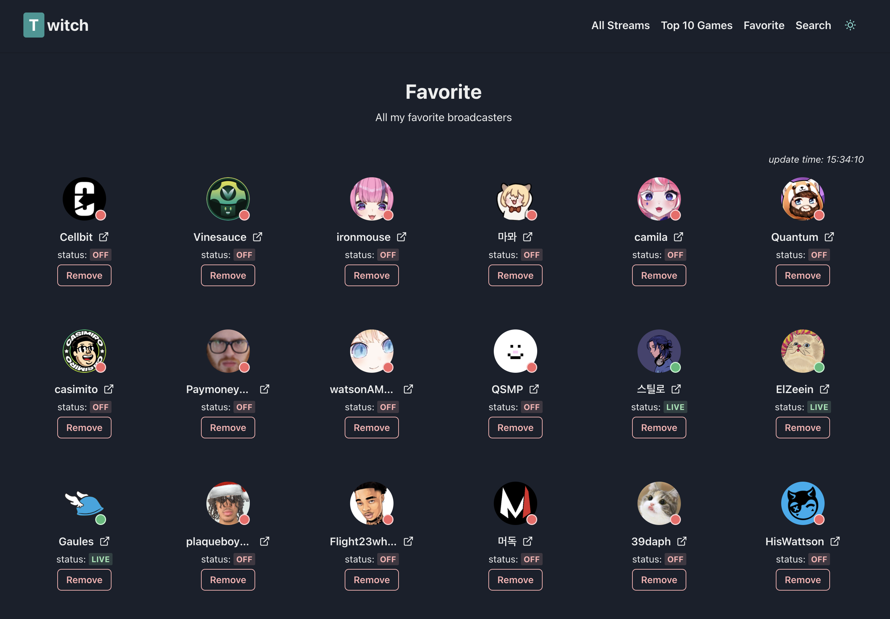
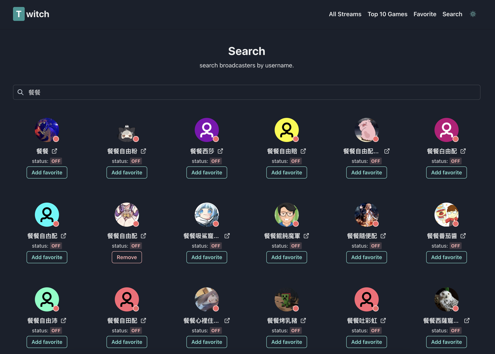

# Twitch Streaming

## 簡介

首先會有這個專案是因為當時我在讀 [Redux 官方教學](https://redux.js.org/tutorials/essentials/part-1-overview-concepts) ，其中有幾個章節是在介紹 RTK Query（底下簡稱 RTKQ）這套 Redux toolkit 裡面自帶的工具。

雖然在教學中就已經介紹了許多 RTKQ 的強大之處，但我還是有點好奇實際用在專案上會是怎麼樣？所以就稍微想了一下有沒有什麼可以搭配 RTKQ 來實作的小東西？於是就想起了我在幾年前做過的 [twitch 熱門實況列表](https://github.com/jubeatt/Twitch-top-5-games-steams)。正好我也對 twitch 蠻有興趣的，所以就決定用它來當作這次的練習！

也藉此重溫一下 Redux，希望在這份專案中能做到 Best Practice。

接著稍微介紹一下這份專案內容，總共有底下幾個功能：

- 查看目前所有的實況列表（依觀看人數排序）
- 查看各別遊戲的實況列表（取前十名熱門遊戲）
- 收藏直播主的功能
- 搜尋直播主的功能
- 支援 RWD
- 支援深淺色模式

網站連結：https://jubeatt.github.io/twitch-streaming/

**實況列表：**



**收藏頁面：**



**搜尋頁面：**



## 使用技術

這份專案是以 Create React App 來建立，並包含底下項目：

- Redux Toolkit
- RTK Query
- Chakra-ui
- TypeScript
- React Router
- Zero `useEffect`

## 開發相關

這份專案使用的 Node 版本為 `v14.21.2`。

1\. 安裝依賴項目：

```
npm ci
```

2\. 建立 `.env.development` 及 `.env.production` 並填入底下內容：

```
# for Twitch
REACT_APP_CLIENT_ID=<your_client_id>
REACT_APP_APP_ACCESS_TOKEN=<your_token>

# for EmailJS
REACT_APP_APP_SERVICE_ID=<emailjs_service_id>
REACT_APP_APP_TEMPLATE_ID=<emailjs_template_id>
REACT_APP_APP_USER_ID=<emailjs_user_id>
```

註：本專案有使用 [EmailJS](https://www.emailjs.com/) 來啟用寄信的功能（出錯時自動發通知給作者），所以才會需要填入相關的環境設定

3\. 啟動 dev server：

```
npm run start
```

4\. 部署至 github：

```
npm run deploy
```
